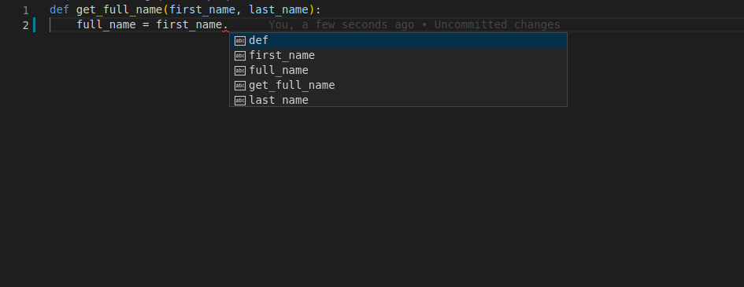
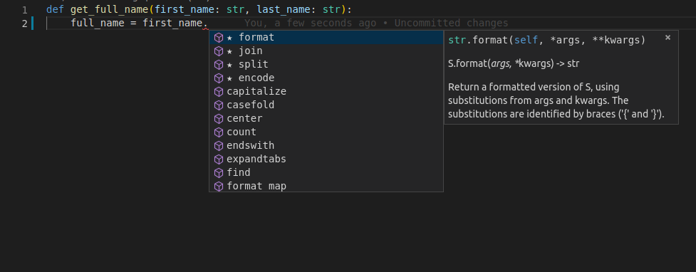

Python has support for optional "type hints" (also called "type annotations").

These "type hints" or annotations are a special syntax that allow declaring the type of a variable.

By declaring types for your variables, editors and tools can give you better support.

This is just a quick tutorial / refresher about Python type hints. It covers only the minimum necessary to use them with FastAPI
... which is actually very little.

FastAPI is all based on these type hints, they give it many advantages and benefits.


# What are these type_hints?
Let's start with a simple example:
```
def get_full_name(first_name, last_name):
    full_name = first_name.title() + " " + last_name.title()
    return full_name


print(get_full_name("john", "doe"))

Calling this program outputs: John Doe
```

# Edit it¶
It's a very simple program.

But now imagine that you were writing it from scratch.

At some point you would have started the definition of the function, you had the parameters ready...

But then you have to call "that method that converts the first letter to upper case."

Was it upper? Was it uppercase? first_uppercase? capitalize?

Then, you try with the old programmer's friend, editor autocompletion.

You type the first parameter of the function, first_name, then a dot (.) and then hit Ctrl+Space to trigger the completion.

But, sadly, you get nothing useful:


# Add types¶
Let's modify a single line from the previous version.

We will change exactly this fragment, the parameters of the function, from:

```  
  first_name, last_name to first_name: str, last_name: str
```

That's it.

Those are the "type hints":
```
    def get_full_name(first_name: str, last_name: str):
        full_name = first_name.title() + " " + last_name.title()
        return full_name
    print(get_full_name("john", "doe"))
```
That is not the same as declaring default values like would be with:


    first_name="john", last_name="doe"
It's a different thing.

`We are using colons (:), not equals (=).`

And adding type hints normally doesn't change what happens from what would happen without them.

But now, imagine you are again in the middle of creating that function, but with type hints.

At the same point, you try to trigger the autocomplete with Ctrl+Space and you see:



This is why type_hints in python are useful.

# Type of type_hints: 
`1. Simple Types`

These are the standard types which are very common in python such as int, str, bool, bytes.

`2. Generic types with type parameters`

These are the types that contain other values also such as dict, list, set, and tuple.
The internal values in these types can have their own type. These types that have internal types are called "generic"
types. And it's possible to declare them, even with their internal types.
To declare those types and the internal types, you can use the standard Python module typing. It exists specifically
to support these type hints.

As Python advances, newer versions come with improved support for these type annotations and in many cases you won't 
even need to import and use the `typing` module to declare the type annotations.
    
For ex: 
In 3.6+ code will look like:
```
from typing import List

def process_items(items: List[str]):
    for item in items:
        print(item)
```

and In 3.9+ same logic code will look like:
```
def process_items(items: list[str]):
    for item in items:
        print(item)
```
In the above codes when you toggle on `item` the editor will automatically suggest you the string methods
due to the Generic type_hints functionality.

# Union
You can declare that a variable can be any of several types, for example, an int or a str.
In Python 3.6 and above (including Python 3.10) you can use the Union type from typing and put inside the square brackets
the possible types to accept. Ex:
```
    from typing import Union
    
    def process_item(item: Union[int, str]):
        print(item)
```

In Python 3.10 there's also a new syntax where you can put the possible types separated by a vertical bar (|).
```
    def process_item(item: int | str):
        print(item)
        
    For this code to be execute you must have python-multipart module installed
```
In both cases this means that item could be an `int` or a `str`.

# Possibly `None`
you can declare a value str or int, but sometimes it can be none also that is you have used the type as
str but value received by function is None. So, to encounter that we can use `Optional` from the
`typing` module i.e., 
```
    from typing import Optional
    
    def say_hi(name: Optional[str] = None):
        if name is not None:
            print(f"Hey {name}!")
        else:
            print("Hello World")
```
Using `Optional[str]` instead of just str will let the editor help you to detect errors where you could be assuming that 
a value is always a str, when it could actually be None too.

`Optional[Something]` is actually a shortcut for `Union[Something, None]`, they are equivalent.
```
    from typing import Union
    def say_hi(name: Union[str, None] = None):
        if name is not None:
            print(f"Hey {name}!")
        else:
            print("Hello World")
```
In Best practise it is better to use `Union` instead of `Optional` as it generates confusion for others.

Similarly, this can be represented in 3.10+ as : 
```
    def say_hi(name: str | None = None):
        if name is not None:
            print(f"Hey {name}!")
        else:
            print("Hello World")
```

# Classes as types
You can also declare Classes as the type of variable i.e., 
```
class Person:
    def __init__(self, name: str):
        self.name = name

def get_person_name(one_person: Person):
    return one_person.name

Here, you can see one_person variable is Person class Type.
```
Remember `one_person` is the instance of Class Person so, Editor will show you the support of class only.

# Pydantic models
`Pydantic` is a Python library to perform data validation.
You can declare the types and attributes of the data using it.
Then you can create an instance of that class with some values and `Pydantic model` will validate
the values, convert them to the appropiate type (if that's the case) abd give you an object
with all the data.
And you get all the editor support with that resulting object.

An example from the official Pydantic docs:
```
from datetime import datetime

from pydantic import BaseModel


class User(BaseModel):
    id: int
    name: str = "John Doe"
    signup_time: datetime | None = None
    friends: list[int] = []


external_data = {
    "id": "123",
    "signup_ts": "2017-06-01 12:22",
    "friends": [1, "2", b"3"],
}
user = User(**external_data)
print(user)
# > User id=123 name='John Doe' signup_ts=datetime.datetime(2017, 6, 1, 12, 22) friends=[1, 2, 3]
print(user.id)
# > 123
```
Here, BaseModel is a pydantic model  which will handle the validation of variable and their types
like id, name, signup_time, and friends.

FastAPI is all based on Pydantic.

# Why use Pydantic?
-> It is powered by `type_hints` i.e., with Pydantic, schema validation and serialization are controlled
by type_hints due to which there is less to learn, less to code and easy integration with your IDE
and static analysis tools.

-> `Speed` - Pydantic's core validation logic is written in Rust. As a result, Pydantic is among the fastest data
validation libraries for Python.

-> `JSON Schema` - Pydantic models can emit JSON Schema, allowing for easy integration with other tools.
JSON Schema can be generated for any Pydantic schema — allowing self-documenting APIs and integration with a wide 
variety of tools which support JSON Schema like Swagger.

Ex:
```
from datetime import datetime
from pydantic import BaseModel

class Address(BaseModel):
    street: str
    city: str
    zipcode: str

class Meeting(BaseModel):
    when: datetime
    where: Address
    why: str = 'No idea'
    
print(Meeting.model_json_schema())
"""
{
    '$defs': {
        'Address': {
            'properties': {
                'street': {'title': 'Street', 'type': 'string'},
                'city': {'title': 'City', 'type': 'string'},
                'zipcode': {'title': 'Zipcode', 'type': 'string'},
            },
            'required': ['street', 'city', 'zipcode'],
            'title': 'Address',
            'type': 'object',
        }
    },
    'properties': {
        'when': {'format': 'date-time', 'title': 'When', 'type': 'string'},
        'where': {'$ref': '#/$defs/Address'},
        'why': {'default': 'No idea', 'title': 'Why', 'type': 'string'},
    },
    'required': ['when', 'where'],
    'title': 'Meeting',
    'type': 'object',
}
"""
```

-> `Performance` - Pydantic's core validation logic is implemented in separate package pydantic-core,
where validation for most types is implemented in Rust.

As a result Pydantic is among the fastest data validation libraries for Python.
Unlike other performance-centric libraries written in compiled languages, Pydantic also has excellent support for
customizing validation via functional validators.

-> `Serialization`
Pydantic provides functionality to serialize model in three ways:

- To a Python dict made up of the associated Python objects
- To a Python dict made up only of "jsonable" types
- To a JSON string

In all three modes, the output can be customized by excluding specific fields, excluding unset fields, excluding 
default values, and excluding None values

-> `Strict mode and data coercion`
By default, `Pydantic` is tolerant to common incorrect types and coerces data to the right type — e.g. a numeric string 
passed to an int field will be parsed as an int.

Ex:
```
from datetime import datetime
from pydantic import BaseModel, ValidationError

class Meeting(BaseModel):
    when: datetime
    where: bytes

m = Meeting.model_validate({'when': '2020-01-01T12:00', 'where': 'home'})
print(m)
#> when=datetime.datetime(2020, 1, 1, 12, 0) where=b'home'
try:
    m = Meeting.model_validate(
        {'when': '2020-01-01T12:00', 'where': 'home'}, strict=True
    )
except ValidationError as e:
    print(e)
    """
    2 validation errors for Meeting
    when
      Input should be a valid datetime [type=datetime_type, input_value='2020-01-01T12:00', input_type=str]
    where
      Input should be a valid bytes [type=bytes_type, input_value='home', input_type=str]
    """

m_json = Meeting.model_validate_json(
    '{"when": "2020-01-01T12:00", "where": "home"}'
)
print(m_json)
#> when=datetime.datetime(2020, 1, 1, 12, 0) where=b'home'
```

`Pydantic` also has strict=True mode — also known as "Strict mode" — where types are not coerced and a validation error
is raised unless the input data exactly matches the schema or type hint.

But strict mode would be pretty useless while validating JSON data as JSON doesn't have types matching many common
python types like datetime, UUID, or bytes so, to overcome that pydantic parsing is used which is very performant
and allows eben sensible data conversions. Since JSON parsing is implemented in Rust, it's also very performant.


